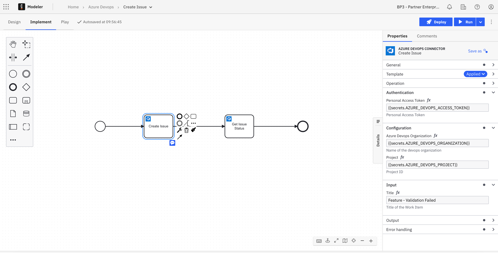

# Camunda Azure DevOps Custom Connector Template
This project contains a custom Camunda 8 Connector template that provides access to Azure Devops REST API operations.

# How to install the connector

## With Web Modeler
The following instructions supplies the details on how to install the connector template when using the Web Modeler, which can be used in a SaaS or Self-Managed environment: https://docs.camunda.io/docs/components/connectors/manage-connector-templates/#importing-existing-connector-templates

## Within Desktop Modeler
The following instructions detail how to install the connector template when using the Desktop Modeler, which can be used in a SaaS or Self-Managed environment:: https://docs.camunda.io/docs/components/modeler/desktop-modeler/element-templates/configuring-templates/

# How to use the Connector in a model?
First the Connector template needs to be uploaded to the project. Then, it can be used within a process model, for example:

# Supported Operations
Links below take you to the Azure devops documentation for the specific API
1. [Create Issue/ Task](https://learn.microsoft.com/en-us/rest/api/azure/devops/wit/work-items/create)
2. [Get Issue/ Task](https://learn.microsoft.com/en-us/rest/api/azure/devops/wit/work-items/get-work-item)

It would be a relatively simply matter to add a relatively long list of other operations for the connector, but at this time we feel we would only be doing that because it is easy to do so, rather than because there is a good case for any of them. However we will be happy to add them if someone has a genuine need for them.

# Prerequisites
1. Generate PAT token in Azure devops environment with needed permissions.
2. You will need Azure devops `Organization` and `Project` id.

# Element Template
The element template can be found in the `element-templates/azure-devops-connector-template.json` file.

# Contributing
To contribute to this connector, see the [CONTRIBUTING](CONTRIBUTING.md) file.

# Licence
Any materials for this connector contributed by Camunda (e.g. JSON config file format) are covered by
[Camunda's Documentation Licence](https://github.com/camunda/camunda-docs/blob/main/LICENSE.txt).
Overall this Connector is covered by the [Creative Commons License](LICENSE) included in this repo.